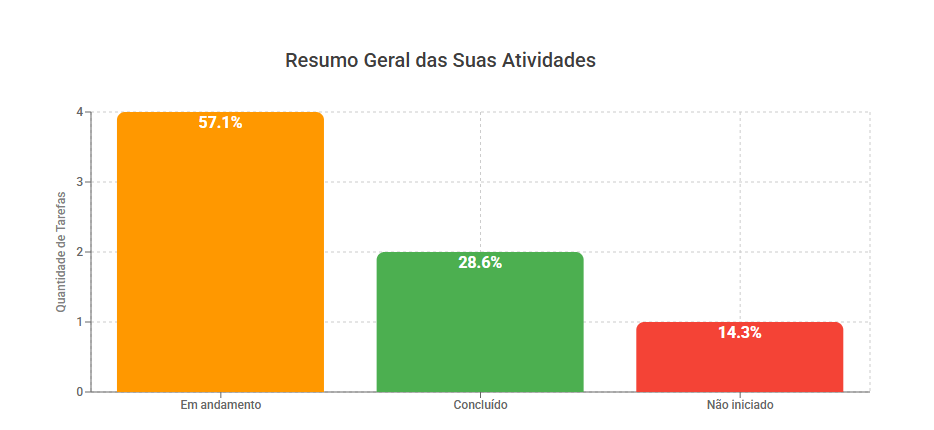

# 📊 OKR Dashboard - Planejamento Estratégico


Um sistema web full-stack para **gestão de projetos e acompanhamento de OKRs (Objectives and Key Results)**.  
Permite cadastrar projetos, gerenciar tarefas e visualizar **painéis de progresso** com gráficos dinâmicos, ajudando equipes a acompanharem metas de forma simples e intuitiva.



---
## 🔗 Acesso Rápido

🔹 **Link de acesso:** [https://opportunum.vercel.app/](https://opportunum.vercel.app/)  
🔹 **Login para teste:**  
```bash
Email: admin@opportunum.com
Senha: Senha@123
```


## 🚀 Funcionalidades

✅ Autenticação de usuários (login com JWT)  
✅ Cadastro e gerenciamento de **projetos**  
✅ Registro e acompanhamento de **tarefas** (pendente, em andamento, concluído)  
✅ **Dashboard geral** com gráfico de status consolidado de todas as tarefas dos projetos  
✅ **Dashboard individual** com gráfico de status consolidado de todas as tarefas pendentes do usuário  
✅ Visualização detalhada de cada projeto com **gráficos individuais**  
✅ UI responsiva com Material UI  
✅ Backend escalável (Node.js + Express + MongoDB)  

---
## 👥 Tipos de Acesso e Permissões

O sistema possui **gestão de papéis (roles)**, permitindo controlar o que cada usuário pode fazer:

| Tipo de Usuário | Permissões |
|----------------|-----------|
| **Master**     | Acesso total ao sistema. Pode criar, editar e excluir usuários, projetos e tarefas. Tem controle de permissões de outros usuários. |
| **Admin**      | Pode gerenciar (criar e editar) projetos e tarefas que está envolvido, adicionar membros aos projetos e acompanhar OKRs. |
| **Assistente** | Tem acesso de visualização aos projetos e tarefas nos quais está envolvido. Pode atualizar tarefas dos projetos que está envolvido. |

🔐 **Gerenciamento de Acessos:**  
- Apenas **Master** pode promover ou rebaixar todos os usuários entre os papéis.  
- Usuário de perfil **Admin** pode promover ou rebaixar apenas os usuários da sua equipe (que estão envolvidos nos mesmos projetos).  
- Usuários podem ser **adicionados/removidos de projetos específicos** para garantir que apenas pessoas relevantes tenham acesso.  
- Controle feito via **painel administrativo** no sistema.

---
## 🛠️ Tecnologias Utilizadas

### **Front-end**
- [React](https://react.dev/)
- [React Router](https://reactrouter.com/) (rotas e navegação)
- [Material UI](https://mui.com/) (UI Components)
- [Recharts](https://recharts.org/) (gráficos interativos)
- Context API (estado global, autenticação)

### **Back-end**
- [Node.js](https://nodejs.org/)
- [Express](https://expressjs.com/)
- [MongoDB Atlas](https://www.mongodb.com/atlas/database) (armazenamento de usuários, projetos e tarefas)
- [JWT](https://jwt.io/) (autenticação segura)
- [bcrypt](https://www.npmjs.com/package/bcrypt) (hash de senhas)

---

## ⚙️ Como Rodar Localmente

### 1️⃣ Clone o repositório
```bash
git clone https://github.com/Mariahsth/opportunum.git
cd opportunum
````
### 1️⃣ Configure o backend
```bash
cd backend-opportunum
npm install
cp .env.example .env   # Configure variáveis (MongoDB URI, JWT_SECRET)
npm run dev
```
Servidor rodará em: http://localhost:5000
### 1️⃣ Configure o frontend
```bash
cd ../frontend-opportunum
npm install
npm run dev
```
Aplicação React em: http://localhost:5173

## 🔑 Variáveis de Ambiente (.env)
Backend:
```bash
PORT=5000
MONGO_URI=sua-string-do-mongodb
JWT_SECRET=sua-chave-secreta
```
Frontend:
```bash
VITE_API_URL=http://localhost:5000/api
```

✨ Autor

Desenvolvido por Mariah Hoffmann 💻